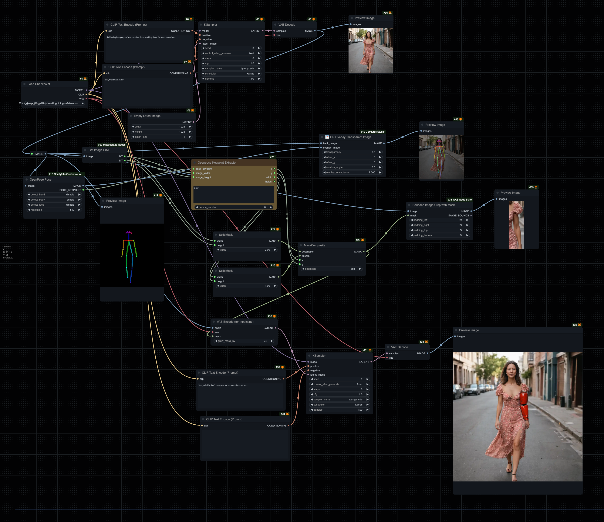

# Openpose Keypoint Extractor
- Take the keypoint output from [OpenPose estimator node](https://github.com/Fannovel16/comfyui_controlnet_aux?tab=readme-ov-file#faces-and-poses-estimators) and calculate bounding boxes around those keypoints.
- You need to give it the width and height of the original image and it will output `(x,y,width,height)` bounding box within that image
- Note that the points on the OpenPose skeleton are *inside* the particular limb (eg center of wrist, middle of shoulder), so you probably will want to apply some padding around the bounding box to get the whole arm, leg or whatever you're looking for.
- Reference for which control point is which - provide comma-separated list in the Node: [OpenPose Docs](https://github.com/CMU-Perceptual-Computing-Lab/openpose/blob/master/doc/02_output.md)

# Example workflow

Drag this to your ComfyUI:

